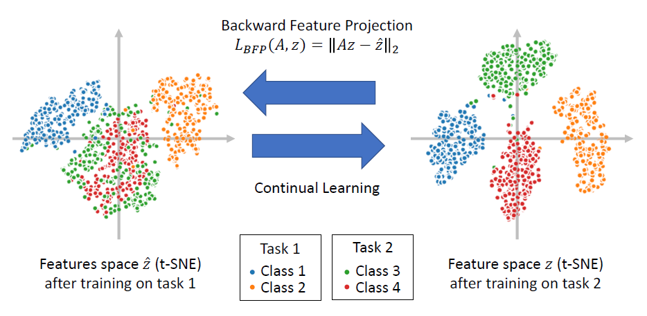

# Preserving Linear Separability in Continual Learning by Backward Feature Projection

This repo provides the official implementation for the CVPR 2023 paper [Preserving Linear Separability in Continual Learning by Backward Feature Projection](https://arxiv.org/abs/2303.14595) (BFP).


## Overview

To achieve a better stability-plasticity trade-off in continual learning, we propose Backward Feature Projection (BFP), a method for continual learning that allows the new features to change up to a learnable linear transformation of the old features. BFP preserves the linear separability of the old classes while allowing the emergence of new feature directions to accommodate new classes.



## Setup

To run the code, please first install [PyTorch](https://pytorch.org/get-started/locally/) according to the setup of your system. 

Then install the following dependencies using `pip`.

```
pip install numpy setproctitle six wandb onedrivedownloader av tqdm matplotlib scipy
```

## Experiments

This repo use [wandb](https://wandb.ai/) to log experiments by default. Please log in your account by `wandb login [KEY]`. 

At the root folder of this repo, run the following commands to reproduce results for DER++ w/ BFP/FD/BFP-2 in the paper. 

```bash
# Based on DER++
## CIFAR10
### Baseline DER++
python ./utils/main.py --project bfp --model bfp --dataset seq-cifar10 --buffer_size 200 --alpha_bfp 0 --exp_suffix derpp_bfp0
python ./utils/main.py --project bfp --model bfp --dataset seq-cifar10 --buffer_size 500 --alpha_bfp 0 --exp_suffix derpp_bfp0

### DER++ w/ different type of projection layer
python ./utils/main.py --project bfp --model bfp --dataset seq-cifar10 --buffer_size 200 --alpha_bfp 1 --proj_type 0 --final_feat --pool_dim hw --exp_suffix derpp_fd
python ./utils/main.py --project bfp --model bfp --dataset seq-cifar10 --buffer_size 200 --alpha_bfp 1 --proj_type 1 --final_feat --pool_dim hw --exp_suffix derpp_bfp
python ./utils/main.py --project bfp --model bfp --dataset seq-cifar10 --buffer_size 200 --alpha_bfp 1 --proj_type 2 --final_feat --pool_dim hw --exp_suffix derpp_bfp2

python ./utils/main.py --project bfp --model bfp --dataset seq-cifar10 --buffer_size 500 --alpha_bfp 1 --proj_type 0 --final_feat --pool_dim hw --exp_suffix derpp_fd
python ./utils/main.py --project bfp --model bfp --dataset seq-cifar10 --buffer_size 500 --alpha_bfp 1 --proj_type 1 --final_feat --pool_dim hw --exp_suffix derpp_bfp
python ./utils/main.py --project bfp --model bfp --dataset seq-cifar10 --buffer_size 500 --alpha_bfp 1 --proj_type 2 --final_feat --pool_dim hw --exp_suffix derpp_bfp2

## CIFAR100
### Baseline DER++
python ./utils/main.py --project bfp --model bfp --dataset seq-cifar100 --buffer_size 500 --alpha_bfp 0 --exp_suffix derpp_bfp0
python ./utils/main.py --project bfp --model bfp --dataset seq-cifar100 --buffer_size 2000 --alpha_bfp 0 --exp_suffix derpp_bfp0

### DER++ w/ different type of projection layer
python ./utils/main.py --project bfp --model bfp --dataset seq-cifar100 --buffer_size 500 --alpha_bfp 1 --proj_type 0 --final_feat --pool_dim hw --exp_suffix derpp_fd
python ./utils/main.py --project bfp --model bfp --dataset seq-cifar100 --buffer_size 500 --alpha_bfp 1 --proj_type 1 --final_feat --pool_dim hw --exp_suffix derpp_bfp
python ./utils/main.py --project bfp --model bfp --dataset seq-cifar100 --buffer_size 500 --alpha_bfp 1 --proj_type 2 --final_feat --pool_dim hw --exp_suffix derpp_bfp2

python ./utils/main.py --project bfp --model bfp --dataset seq-cifar100 --buffer_size 2000 --alpha_bfp 1 --proj_type 0 --final_feat --pool_dim hw --exp_suffix derpp_fd
python ./utils/main.py --project bfp --model bfp --dataset seq-cifar100 --buffer_size 2000 --alpha_bfp 1 --proj_type 1 --final_feat --pool_dim hw --exp_suffix derpp_bfp
python ./utils/main.py --project bfp --model bfp --dataset seq-cifar100 --buffer_size 2000 --alpha_bfp 1 --proj_type 2 --final_feat --pool_dim hw --exp_suffix derpp_bfp2

## TinyImageNet
### Baseline DER++
python ./utils/main.py --project bfp --model bfp --dataset seq-tinyimg --buffer_size 4000 --alpha_bfp 0 --exp_suffix derpp_bfp0

### DER++ w/ different type of projection layer
python ./utils/main.py --project bfp --model bfp --dataset seq-tinyimg --buffer_size 4000 --alpha_bfp 1 --proj_type 0 --final_feat --pool_dim hw --exp_suffix derpp_fd
python ./utils/main.py --project bfp --model bfp --dataset seq-tinyimg --buffer_size 4000 --alpha_bfp 1 --proj_type 1 --final_feat --pool_dim hw --exp_suffix derpp_bfp
python ./utils/main.py --project bfp --model bfp --dataset seq-tinyimg --buffer_size 4000 --alpha_bfp 1 --proj_type 2 --final_feat --pool_dim hw --exp_suffix derpp_bfp2
```

* Add `--n_runs 5` to each command above to get results of 5 runs.
* Add `--base_method er` to each command above to get results of ER w/ BFP/FD/BFP2. 

## Citation

If you find this repo useful, please cite our paper. 

```
@article{gu2023bfp,
  title={Preserving Linear Separability in Continual Learning by Backward Feature Projection},
  author={Gu, Qiao and Shim, Dongsub and Shkurti, Florian},
  journal={arXiv preprint arXiv:2303.14595},
  year={2023}
}
```

## Acknowledgements

This repo is based on [Mammoth](https://github.com/aimagelab/mammoth) codebase. 